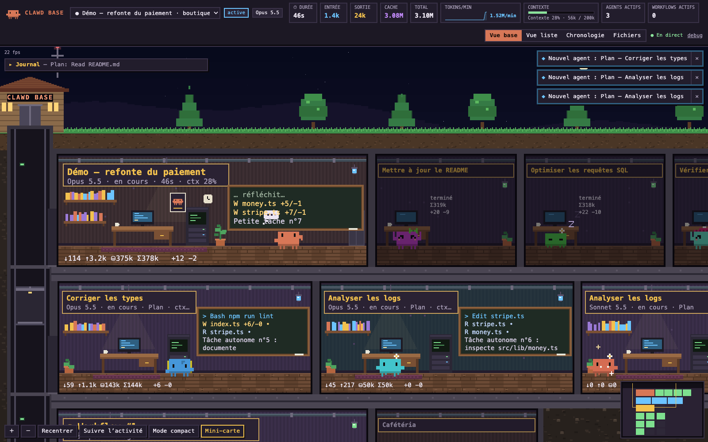
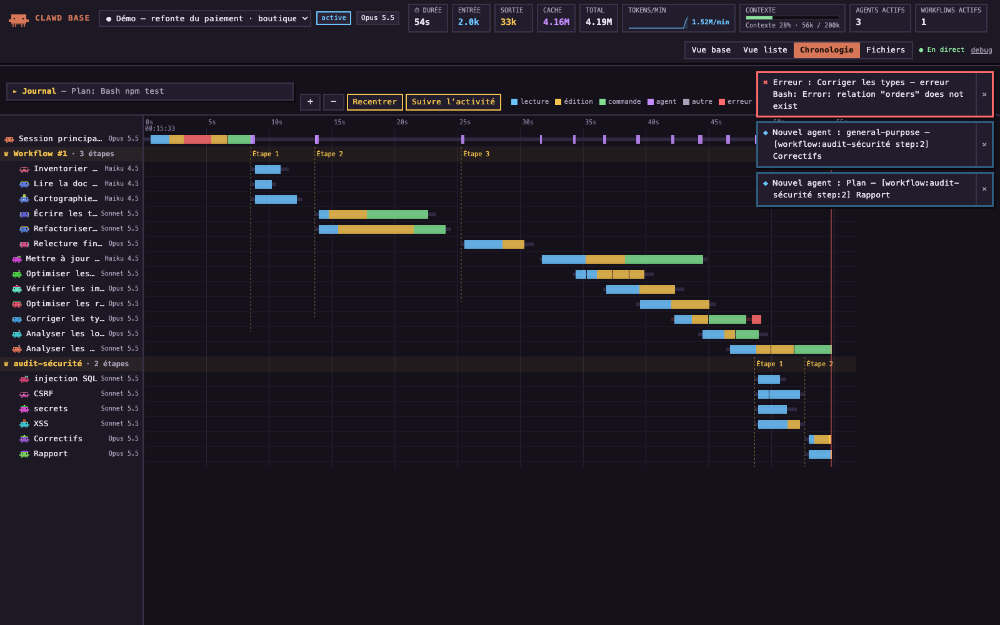
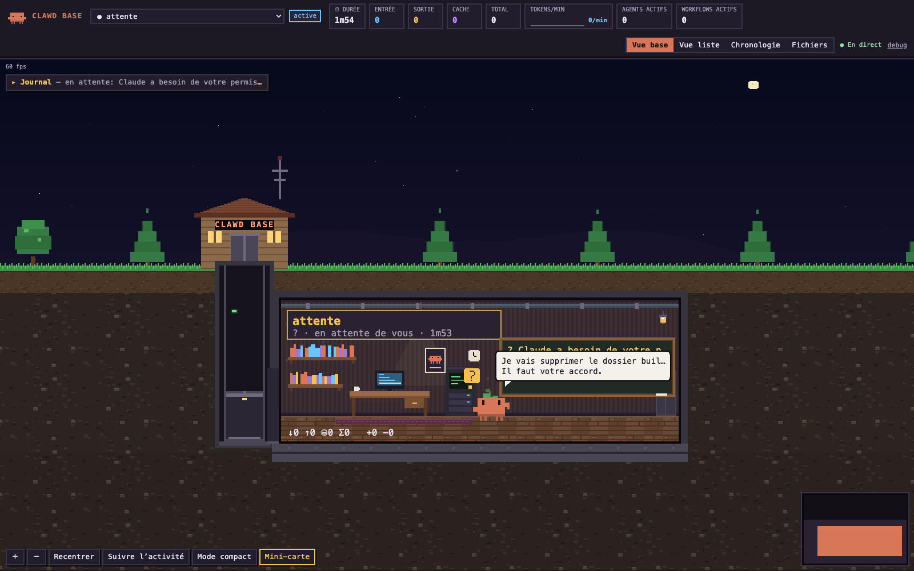
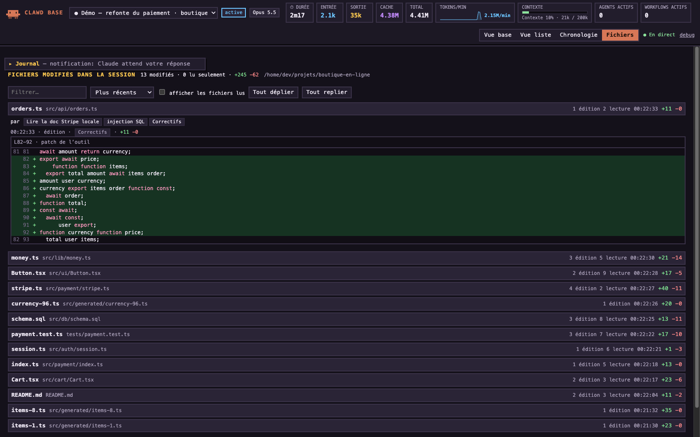
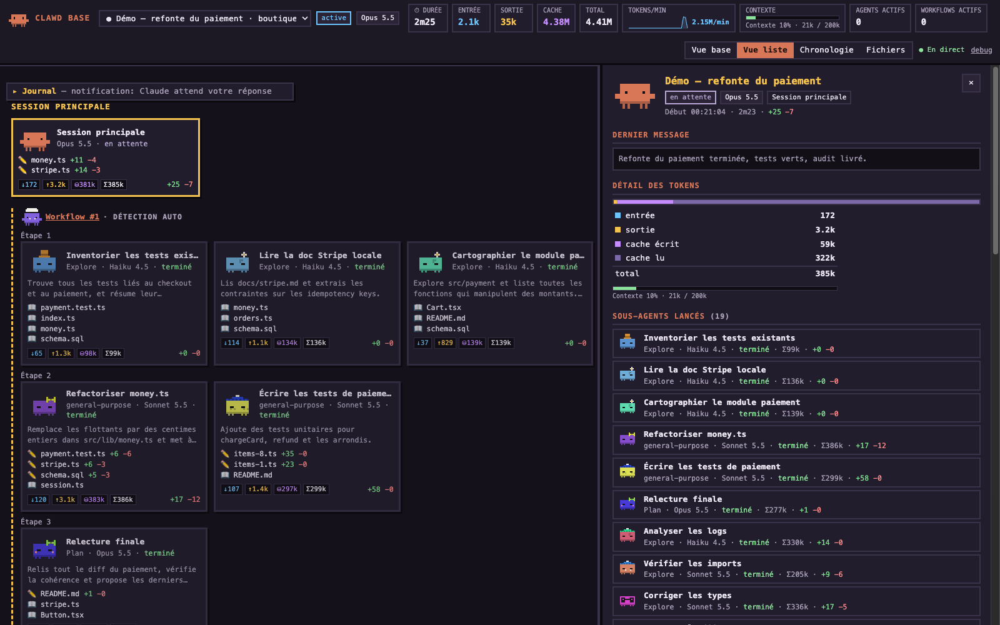

# Clawd Base

**A local, real-time pixel-art dashboard for [Claude Code](https://code.claude.com).** Watch your sessions, every sub-agent the moment it starts, workflows, files and diffs, and token usage (input / output / cache write / cache read / total) per session, agent and workflow — rendered as a cozy **underground base** where every agent works in its own room with its own animated mascot.

🇫🇷 [Lire en français](README.fr.md)

> **Independent project — not affiliated with or endorsed by Anthropic.** "Claude", "Claude Code" and "Clawd" are trademarks of Anthropic. The default mascot is an original character; the optional Clawd sprite is a fan-made pixel rendition.







*(Screenshots show the built-in demo, not real data.)*

## Highlights

- **100 % local** — the server listens on `127.0.0.1` only. No telemetry, no external requests, no CDN.
- **Live** — hooks give instant events; transcripts (`~/.claude/projects/**.jsonl`) give tokens, models and sub-agent activity, and keep the dashboard working even without hooks.
- **Sub-agents & workflows** — every agent gets a room the moment it is launched. Parallel calls in the same message form a step; 2+ steps form a workflow with a chief room and animated cables. You can also group agents explicitly with `[workflow:name step:n]` markers.
- **Exact diffs** — Edit/Write patches with line numbers and syntax highlighting, plus `+N/−M` per file, agent and workflow.
- **Themed rooms**: each room takes the look of the field it works in (game dev, marketing, business, video, design, audio, Discord bots, data/AI, DevOps, security, web): its own decor, an animated screen and object, a matching accessory and tool for the mascot. The field is guessed locally from the MCP servers and skills used, files touched, commands, project name and prompt words (shown with its clues in the panel); sub-agents start from their session's field, workflows take their agents' field. Preview a look with `?theme=game` (any field).
- **Usage like `/usage`, per session**: the share that went to each skill, sub-agent, plugin and MCP server (Claude Code's own attribution, same weighting), the share spent above 150k context, and the last `/context` breakdown.
- **Context gauge** (same formula as Claude Code), tokens/min sparkline, cost, todo lists, compactions, permission prompts ("waiting for you"), optional live text streaming.
- **Four views** — Base (PixiJS game scene), List, Timeline (Gantt of every tool call) and Files. Plus a live journal, toasts and keyboard shortcuts.
- **Guided demo** — click **▶ Demo** for a narrated, 3-minute A-to-Z tour.
- **English / French** UI (auto-detected, FR/EN toggle).

## Install

Requirements: **Claude Code ≥ 2.1** and **Node ≥ 22.13** (persistence uses the built-in `node:sqlite`). The repo ships the built server and UI (`dist/`), so **no `npm install` is needed**.

In Claude Code:

```
/plugin marketplace add walidoudou/clawd-base
/plugin install clawd-base@clawd-base
```

Restart Claude Code, then type **`/dashboard`** (or `/clawd-base:dashboard`). The browser opens on **http://127.0.0.1:4317/**.

Updates: `/plugin marketplace update clawd-base`.

For development, load a local checkout directly:

```bash
claude --plugin-dir /path/to/clawd-base
```

## Usage

| | |
|---|---|
| HUD | session picker, time, tokens in/out/cache/total, estimated cost, tokens/min, context gauge, active agents/workflows, connection, ▶ Demo, FR/EN |
| Base view | the underground base: main session room, one room per sub-agent, one wing per workflow (chief + one column per step), decor rooms, elevator, surface |
| List view | the same information as plain, accessible cards |
| Timeline | one row per agent (grouped by workflow), one bar per tool call coloured by kind, step markers, "now" line |
| Files | every file touched in the session with counters, agents and diffs |
| Click a room | side panel: full prompt, model, status, todo list, context, tool timeline and stats, files with per-file diffs, token breakdown, sub-agents; for the main room, usage by skill / sub-agent / plugin / MCP server |
| Mouse | wheel = integer zoom (pixel-perfect), drag = pan; at the lowest zoom rooms show big labels |
| Keyboard | `Tab` rooms · `Enter` open · `Esc` close · `1`–`4` views · `J` journal |
| Follow activity | the camera glides to the most recently active room |
| Archived (N) | finished agents leave the base after 1 min 30 (5 min on error); this button shows them again — they always stay in the timeline, files and list views |

**Animations**: rooms are dug live (scaffold, bottom-up reveal, dust, lights flickering on); mascots walk to the station matching their tool (bookshelf to read, desk to edit, terminal for commands, board to think); `+N/−N` and token particles; confetti when an agent finishes, fireworks when a session ends; sparks, shaking and a rotating alarm on errors; a compaction whirlwind; data packets running down workflow cables; wandering idle mascots, blinking, fireflies and shooting stars at night.

### Live text streaming (optional)

Claude Code exposes a `MessageDisplay` hook that streams the answer in whole lines. It is declared by the plugin but only runs when `CLAWD_BASE_STREAM=1` (a 2 ms shell guard otherwise). Enable it in `~/.claude/settings.json`:

```json
{ "env": { "CLAWD_BASE_STREAM": "1" } }
```

### Simulator

```bash
npm run simulate
```

```bash
npm run simulate -- --speed 2 --lang en
```

```bash
npm run simulate -- --replay ~/.claude/projects/<project>/<session>.jsonl --speed 20
```

The first two play the guided demo over HTTP against a running server; `--replay` replays a real transcript (and its sub-agents) under a new session id. Simulated sessions (`sim-…`) are never persisted and are forgotten after 15 idle minutes.

## Configuration

`~/.clawd-base/config.json` (optional):

```json
{ "port": 4317, "spriteSet": "mole", "persist": true, "maxAgeHours": 24 }
```

- `spriteSet`: `"mole"` (default, original mascot "Taupi") or `"clawd"`.
- Environment variables: `CLAWD_BASE_PORT` (server **and** hooks), `CLAWD_BASE_DATA_DIR`, `CLAWD_BASE_PROJECTS_DIR`, `CLAWD_BASE_STREAM`, `CLAWD_BASE_CAPTURE=<file.jsonl>` (records raw hook payloads, for debugging). Put them in the `env` block of `~/.claude/settings.json` so the hooks and `/dashboard` both see them.
- Transcripts are read from `~/.claude/projects`, or `$CLAUDE_CONFIG_DIR/projects` when `CLAUDE_CONFIG_DIR` is set.
- Server flags: `--port`, `--projects-dir`, `--data-dir`, `--no-persist`, `--max-age-hours`.

**Custom mascot**: add a `SpriteSet` in `packages/shared/src/sprites/` (8 animations as character grids + palette + anchors), register it in `SPRITE_SETS`, and select it with `spriteSet`. Every agent still gets a unique, deterministic look (FNV-1a hash of its id → seeded RNG → colour, accessory, detail); workflow chiefs always wear a crown or a chef hat.

## How it works

```
Claude Code ──hooks──▶ scripts/send-event.mjs ──POST /api/hook──▶ Node server (127.0.0.1:4317)
                        (non-blocking, exit 0)                      │   ▲
~/.claude/projects/**/*.jsonl ───────── chokidar (incremental tail) ─┘   │
                         normalise ─▶ StateStore (in memory, idempotent) ─▶ SSE /api/stream ─▶ browser
                                         └▶ node:sqlite (hook events)                  (React + PixiJS)
```

Every fact (from a hook or a transcript line) becomes a `NormalizedEvent`, reduced idempotently: the same fact from both sources, or replayed, counts once. Formats were verified on Claude Code 2.1.288 — including real captured payloads and the zod schemas embedded in the binary — see [`docs/FINDINGS.md`](docs/FINDINGS.md).

- **Tokens**: transcripts write one line per content block with the same `usage`, so usage is deduplicated by `message.id`. Context = `input + cache_creation + cache_read` of the latest request; the window comes from the model (Opus 4.7+, Sonnet 5+, Fable: 1M) or `/context`.
- **Usage shares**: Claude Code writes `attributionSkill` / `attributionAgent` / `attributionPlugin` / `attributionMcpServer` on each assistant line. Each request weighs `(cache read + input × 10 + cache write × 12.5 + output × 50) × model tier` (Haiku 1, Sonnet 3, Opus 5, Fable 10), as `/usage` does (2.1.289).
- **Diffs**: tool `structuredPatch` first, then a PreToolUse snapshot vs disk, then old/new strings.
- **Workflows**: explicit markers > native `Workflow` tool > heuristic (same assistant message = one parallel step; consecutive steps in the same user turn; 2+ steps = workflow).
- **Agents** can be resumed after finishing (SendMessage, coordinator): any newer activity brings them back to "running".

## Privacy & safety

- Bound to `127.0.0.1`; non-local `Host`/`Origin` headers are rejected (DNS-rebinding / CSRF protection).
- The hook never blocks Claude Code: it always exits 0, prints nothing, times out after 0.8 s (hard limit 1.5 s), and exits in ~40 ms when the server is down. Only Write/Edit `PreToolUse` is synchronous (2 s timeout) to snapshot the file before it changes.
- Memory caps everywhere (tool outputs, snapshots, diffs, tools per agent, sessions, SSE replay buffer in bytes, textures).
- `~/.clawd-base` is owner-only (0700, files 0600). Each server run writes `server.json` there (port + a random token); the hook sends that token, and only authenticated hooks make the server read files (snapshots for diffs). On a shared machine, other local accounts can still reach `127.0.0.1` and open the dashboard, but cannot make it read your files.
- After a plugin update, `/dashboard` stops the previous server (authenticated `POST /api/shutdown`) and starts the new one.

## Known limitations

- **No token-by-token streaming**: events appear when Claude Code emits them (tool boundaries, transcript lines). Optional streaming works line by line.
- **Internal reasoning may not be exposed**; thinking blocks are not displayed.
- Tokens only come from transcripts (hooks carry none), hence a slight delay.
- Heuristic workflow detection is an approximation — use markers for exact grouping.
- Tested on macOS (CI runs on Linux too); **Windows is untested**.
- Single machine, single user (`~/.claude/projects`).

## Development

```bash
npm install
```

```bash
npm run dev:server
```

```bash
npm run dev:web
```

```bash
npm test
```

```bash
npm run build
```

`dev:web` serves the UI on http://127.0.0.1:5173 with `/api` proxied to the server. `npm test` runs the Vitest suite (transcript parsing, usage dedup, diffs, workflow detection, deterministic mascots, store, real hook schemas, server integration, hook script, base layout, guided demo). `npm run build` writes `dist/web` and `dist/server.mjs` — commit them, since the installed plugin runs from `dist/`. See [CONTRIBUTING.md](CONTRIBUTING.md).

## License

[MIT](LICENSE) © walidoudou. Bundled dependencies: see [THIRD_PARTY_LICENSES.md](THIRD_PARTY_LICENSES.md).
